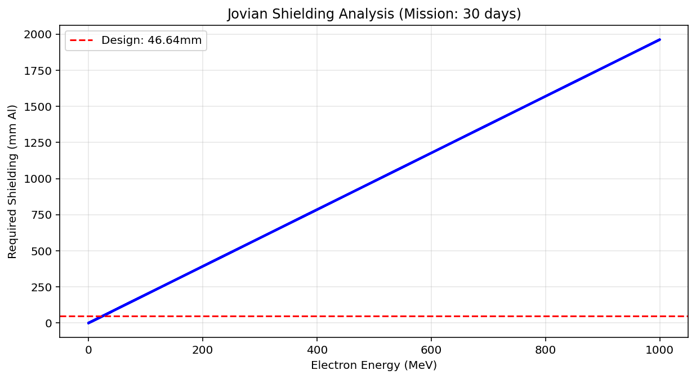

# Spacecraft Design for Jovian Missions

### 1. Project Overview

This project simulates a spacecraft mission to Ganymede to characterise the harsh Jovian radiation environment. By integrating high-fidelity orbital mechanics simulations with the JOSE radiation model, the project determines the optimal aluminum shielding thickness required for mission survival.

**Key Aims:**

* Simulate a stable polar orbit around Ganymede using **Tudat**.
* Characterize the electron radiation fluence using **SPENVIS (JOSE model)**.
* Calculate the required shielding mass using **Weber’s Range-Energy approximation**.

### 2. Workflow & Methodology

The project is divided into three phases:

* **Phase 1: Orbital Dynamics (Python/Tudat)**
  * Propagated a spacecraft in a 500km altitude polar orbit around Ganymede.
  * Modelled Third-Body Gravity (Jupiter, Europa, Callisto) and Solar Radiation Pressure.
  * **Output:** Cartesian state vectors converted to J2000 frame. 

* **Phase 2: Radiation Environment (SPENVIS)**
  * Converted trajectory data to CCSDS/Text format for the **JOSE (Jovian Specification Environment)** model.
  * Analyzed integral electron fluence spectra over a 30-day mission duration using **JOREM**. 
  * **Output:** Energy vs. Fluence spectral data.

* **Phase 3: Shielding Optimisation (Python)**
  * Processed JOSE spectral data to determine the maximum hazardous energy level (~20 MeV).
  * Calculated the stopping power and range of electrons in aluminum using Weber's empirical approximation (1964).
  * **Result:** Determined required shielding thickness (approx. **46.6 mm** Al) with a 20% safety margin.

### 3. Dependencies

The propagation needs to be done in the Tudat environment, which can be installed from the [Tudat website](https://docs.tudat.space/en/latest/).

Standard imports of `numpy`, `pandas` and `matplotlib` are also used. 

### 4. Usage

**Step 1: Run the Trajectory Simulation**
Generates the orbit and exports the trajectory file for SPENVIS. Run `spacecraft_trajectory_propagator.py`.

**Step 2: Radiation Data (SPENVIS)**

* Upload the generated trajectory .oem file to [SPENVIS](https://www.spenvis.oma.be/).
* Run the **JOSE** model (Trapped Radiation > Jupiter Models).
* Download the "Averaged proton and electron fluxes" text file.

**Step 3: Calculate Shielding**
Reads the SPENVIS data and computes the aluminum thickness, run `calculate_thickness.py` using the `spenvis_sao.txt` file. 

## Theory: Shielding Calculation

To protect the spacecraft electronics from the Jovian electron environment, we calculate the required shielding thickness using the **Range-Energy relationship** for electrons in aluminum.

### 1. Stopping Power & Range
As high-energy electrons traverse the shielding material, they lose energy in two main ways:
* **Collisional Losses:** Interactions with atomic electrons (dominant at low energies).
* **Radiative Losses (Bremsstrahlung):** Emission of X-rays due to deflection by atomic nuclei (dominant at high energies, $E > 10$ MeV).

The **Range ($R$)** is the average distance a particle travels before coming to rest, measured in areal density ($g/cm^2$).

### 2. Weber's Approximation
We utilise the empirical approximation derived by **K.H. Weber (1964)** for electrons in aluminum. This model splits the energy spectrum into two regimes:

#### **Regime 1: Low Energy ($E < 2.5$ MeV)**
At lower energies, the range follows a power law relationship:

$$
R = 0.412 \cdot E^{(1.265 - 0.0954 \ln E)}
$$

#### **Regime 2: High Energy ($E \geq 2.5$ MeV)**
At higher energies, the relationship becomes linear due to relativistic effects and radiative dominance:

$$
R = 0.530 \cdot E - 0.106
$$

*Where:*
* $R$ = Range ($g/cm^2$)
* $E$ = Electron Energy (MeV)

### 3. Calculating Thickness
The physical thickness ($t$) is derived from the Range ($R$) and the density of Aluminum ($\rho_{Al} \approx 2.70 \ g/cm^3$):

$$
t_{mm} = \frac{R}{\rho_{Al}} \cdot 10
$$

This thickness represents the minimum material required to stop an electron of energy $E$.

## Results

As an example, the 30 day period starting 02/02/2026 has been used, with the following initial orbital parameters: 
* Altitude: 1km
* Eccentricity, argument of periapsis, longitude of ascending node and true anomaly: zero
* Inclination: 90 degrees

The max hazardous energy detected was _20.0 MeV_, meaning the raw required thickness would be _38.87 mm_. The recommended thickness (with a 20% Safety Margin) would be _46.64 mm_. The following plot was produced: 

## References

* **Orbital Mechanics:** [TudatPy Documentation](https://docs.tudat.space/)
* **Radiation Physics:** Knoll, G.F. (2010). *Radiation Detection and Measurement*, Ch. 2.
* **Shielding Equations:** Weber, K.H. (1964). *Das Reichweite-Energie-Verhältnis für Elektronen in Festkörpern*.
* **Environment Model:** SPENVIS / JOSE (Jovian Specification Environment).
